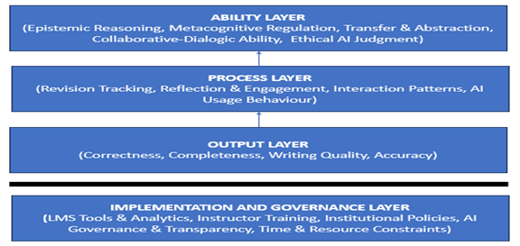

# ALIGNED Framework

The ALIGNED framework is a hierarchical assessment model for AI-supported LMS environments.

The framework consists of:

1. Output Layer
2. Process Layer
3. Ability Layer
4. Implementation & Governance Layer

The model emphasizes upward interpretation from outputs toward underlying learner abilities.

Observable outputs alone are insufficient indicators of authentic learning in AI-mediated environments.

The framework therefore integrates:
- Performance evidence
- Behavioral evidence
- Cognitive and metacognitive abilities
- Institutional and technological implementation considerations
